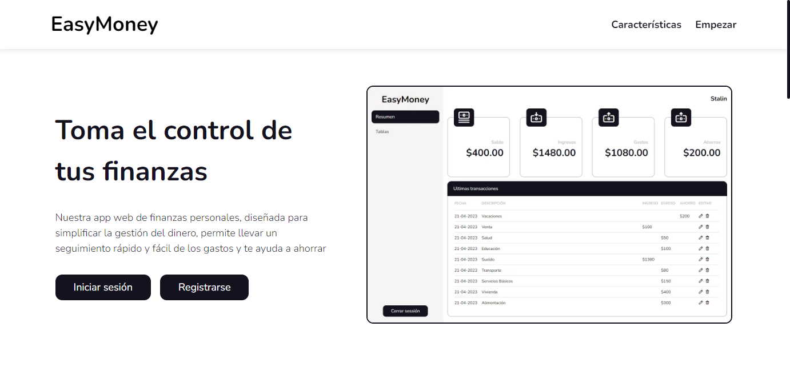

# <p align="center">EasyMoney</p>

App web de finanzas personales, diseñada para simplificar la gestión del dinero, permite llevar un seguimiento rápido y fácil de los gastos y te ayuda a ahorrar.



## Tabla de contenido

- [EasyMoney](#easymoney)
  - [Tabla de contenido](#tabla-de-contenido)
  - [Resumen](#resumen)
    - [Características](#características)
    - [Links](#links)
    - [Construido con](#construido-con)
  - [Autor](#autor)
  - [Instalación](#instalación)
  - [Utilización](#utilización)

## Resumen

### Características

La aplicación web de finanzas personales ofrece una amplia variedad de funciones para ayudarte a gestionar tus finanzas de manera eficiente. A continuación, se detallan las principales características de la aplicación:

- Registro de usuario: La aplicación te permite registrarte fácilmente a través de correo electrónico y próximamente también podrás hacerlo mediante Google, Microsoft y GitHub.
- Creación de transacciones: En el apartado de tablas podrás registrar tus transacciones y llevar un control detallado de tus gastos e ingresos.
- Resumen financiero: La aplicación muestra un resumen visual de tu situación financiera actual, con información relevante sobre tu saldo total, ingresos, gastos y ahorros.
- Detalles de transacciones: Puedes ver los detalles de cada transacción, incluyendo la fecha, descripción y el monto de la misma.
- Edición y eliminación de transacciones: La aplicación te permite editar o eliminar las transacciones de los últimos meses, lo que te permite mantener tus registros precisos y actualizados.
- Visualización por paginación: Puedes visualizar tus transacciones mediante la paginación por mes, lo que te permite tener una visión general de tus finanzas durante un periodo determinado.

### Links

- Repositorio: [GitHub](https://github.com/StalinAM/easy-money-app)
- Sitio en vivo: [EasyMoney](https://easy-money-app.vercel.app/)

### Herramientas

- [JavaScript](https://www.javascript.com/)
- [React](https://react.dev/)
- [Firebase](https://firebase.google.com/?hl=es-419)
- [React Router](https://reactrouter.com/en/main)
- [Styled Components](https://styled-components.com)
- [Vitejs](https://vitejs.dev/)
- [Vercel](https://vercel.com)

## Autor

- GitHub - [StalinAM](https://github.com/StalinAM)
- Sitio Web - [SVAM](https://svam.netlify.app/)

## Instalación

Para instalar el proyecto, siga estos pasos:

- Clonar el repositorio:

```bash
git clone https://github.com/StalinAM/easy-money-app.git
```

- Instalar dependencias:

```bash
npm install
# or
yarn install
```

## Utilización

Para iniciar el servidor de desarrollo, ejecute el siguiente comando en el terminal:

```bash
npm run dev
# or
yarn dev
```
